# SDM-Release-Automation
Case Study to create an SDLC with CA Service Desk Manager

Um einen Software-Entwicklungs-Lebenszyklus (SDLC) mit CA Service Desk Manager realisieren zu können, wird eine Pipeline von verschiedenen Tools benötigt.

* Projekt-Portfolio Management (Wasserfall oder Agil)
* Source Code Management
* Continous Delivery 
* Continous Testing
	* GUI Test
	* Funktionstest
	* Performance Test
	* Service - Mockups zur Bereitstellung nicht vorhandener Backend-Systeme
* Produktives Monitoring der Anwendung
	* Synthetisches Monitoring
	* Transaktionsbasiertes Monitoring

# Digital BizOps Starter Edition
Für die Case Study nutzen wir die [Digital Bizops Starter Edition](https://www.broadcom.com/info/enterprise/starter-edition-software) von [Broadcom](https://www.broadcom.com) und [GitHub](https://github.com) für das Source Code Management.

## Continuous Delivery Director

Wir starten mit der Einrichtung des Continuous Delivery Director.
Nachdem die [Zugangsberechtigungen](https://cddirector.io/cdd/sign-in.jsp?task=signup) vorhanden sind konfigurieren wir ein Projekt, laden weitere Mitarbeiter ein und erzeugen die notwendigen Komponenten.

### Projekt erzeugen
Hinter dem Zahnrad-Menu-Icon ist das ```Projekt Managment``` Menu, in dem sich neue Projekte erzeugen lassen. Wenn bereits ein entspreches Projekt existiert kann dorthin über das = Menu-Icon gewechselt werden.
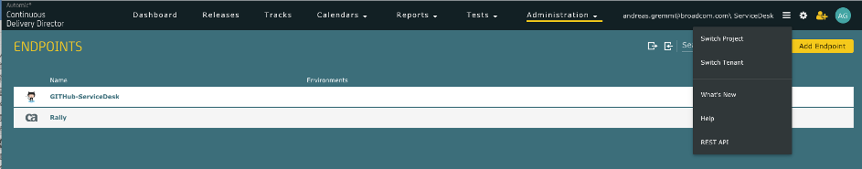

### Mitarbeiter einladen
Wenn mehrere Mitarbeiter im Projekt mitarbeiten sollen, sollten diese eingeladen werden.
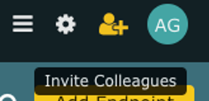

### Endpunkte definieren
Um CDD funktional mit Automatismen zu füllen, müssen die Endpunkte konfiguriert werden. 
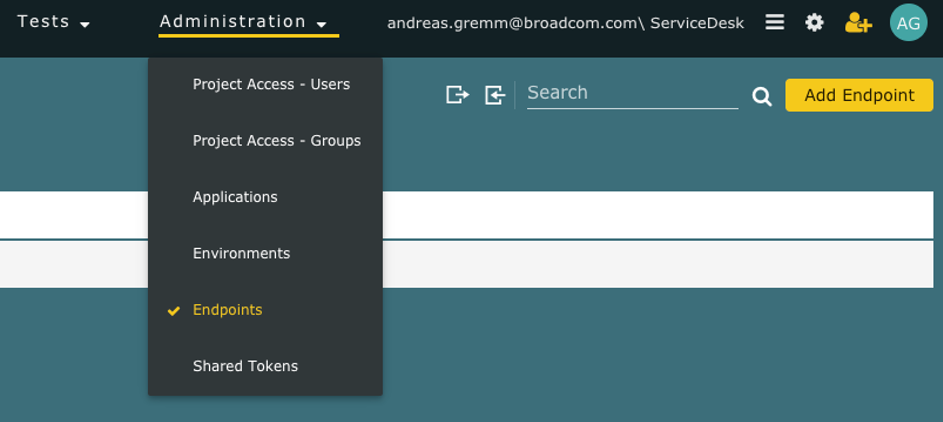

Für die Endpunkte müssen spezifische Parameter ausgefüllt werden.
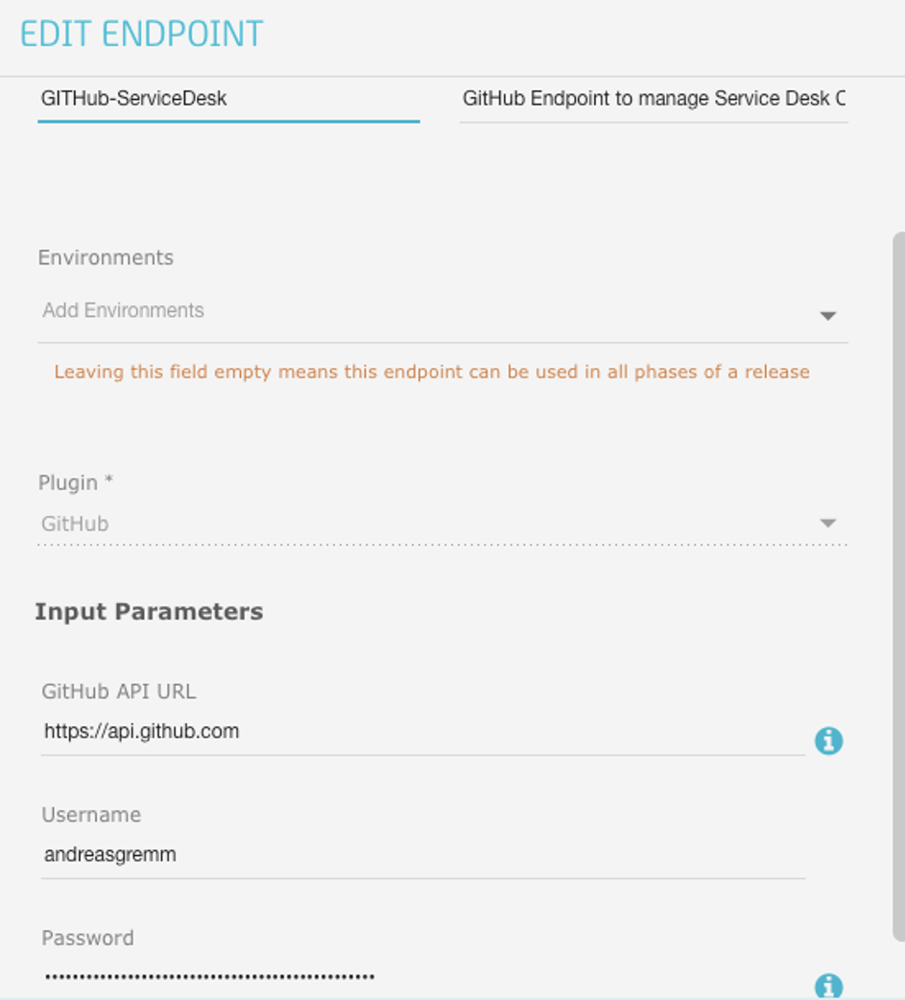

### Anwendungen und Umgebungen definieren
Releases ranken sich um Anwendungen, Umgebungen, Zeiträume etc.

Als erstes wollen wir die Anwendungen definieren, da wir Continuous Delivery Automation nicht nutzen werden, wird es eine ```lokale Anwendung```.
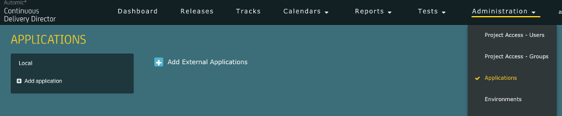

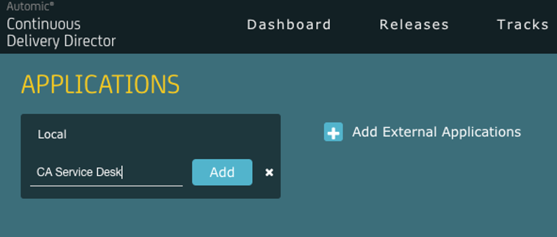

Der Anwendung werden dann Umgebungen zugewiesen.
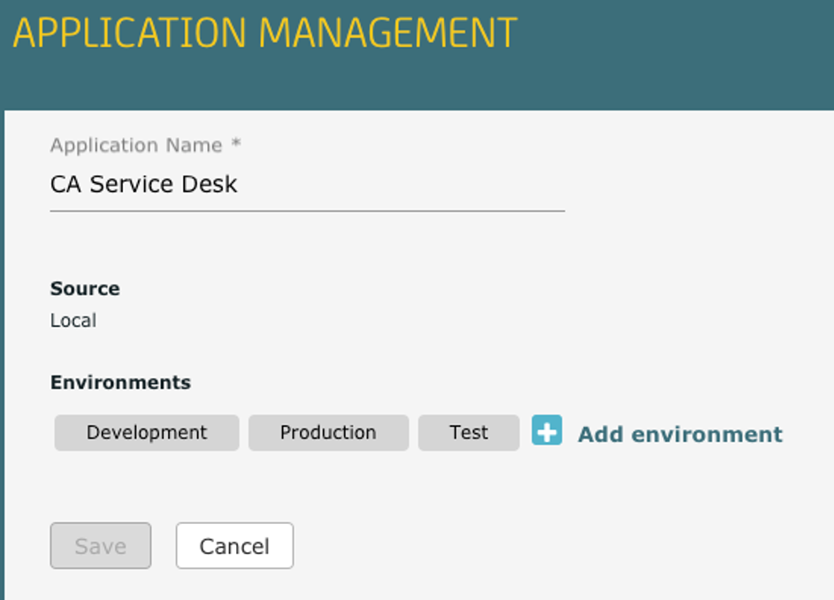

Diese Umgebungen können danach spezifisch modifiziert werden.
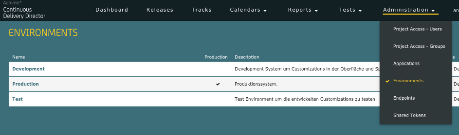

### Release erzeugen
Nachdem die Voraussetzungen erfüllt sind, werden die Releases definiert. 

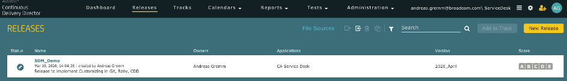

Hier zu sehen die Definition des SDM Releases für unser Beispiel.
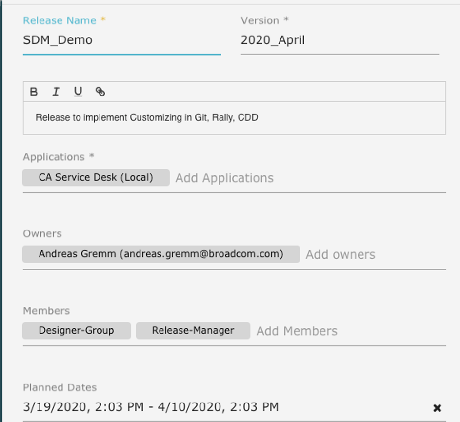

Im Rahmen des Releases werden die Anwendungen und Work-Items konfiguriert, für unsere Anwendung in diesem Release wird eine Version definiert. Hier am Beispiel einer Anwendung "CA Service Catalog".
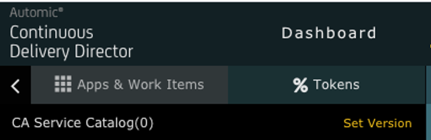


