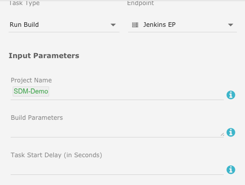

# SDM-Release-Automation
Case Study um ein SDLC mit dem CA Service Desk Manager zu realisieren.

Um einen Software-Entwicklungs-Lebenszyklus (SDLC) mit CA Service Desk Manager realisieren zu können, wird eine Pipeline von verschiedenen Tools genutzt.

* Projekt-Portfolio Management (Wasserfall oder Agil)
* Source Code Management
* Continous Delivery 
* Continous Testing
	* GUI Test
	* Funktionstest
	* Performance Test
	* Service - Mockups zur Bereitstellung nicht vorhandener Backend-Systeme
* Produktives Monitoring der Anwendung
	* Synthetisches Monitoring
	* Transaktionsbasiertes Monitoring

# Digital BizOps Starter Edition
Für die Case Study nutzen wir die [Digital Bizops Starter Edition](https://www.broadcom.com/info/enterprise/starter-edition-software) von [Broadcom](https://www.broadcom.com) und [GitHub](https://github.com) für das Source Code Management.

## Continuous Delivery Director

Wir starten mit der Einrichtung des Continuous Delivery Director.
Nachdem die [Zugangsberechtigungen](https://cddirector.io/cdd/sign-in.jsp?task=signup) vorhanden sind, konfigurieren wir ein Projekt, laden weitere Mitarbeiter ein und erzeugen die notwendigen Komponenten.

### Projekt erzeugen
Hinter dem Zahnrad-Menu-Icon ist das ```Projekt Managment``` Menu, in dem sich neue Projekte erzeugen lassen. Wenn bereits ein entspreches Projekt existiert kann dorthin über das = Menu-Icon gewechselt werden.


### Mitarbeiter einladen
Wenn mehrere Mitarbeiter im Projekt mitarbeiten sollen, werden diese eingeladen.


Die Mitarbeiter müssen im Rahmen des Berechtigungskonzeptes in Rollen (Designer, Release-Manager) und/oder Gruppen (Designer-Group, ReleaseManagerGroup) für das Projekt bzw. das später definierte Release eingeordnet werden.
### Endpunkte definieren
Um CDD funktional mit Automatismen zu füllen, müssen die Endpunkte konfiguriert werden. 


Für die Endpunkte müssen spezifische Parameter ausgefüllt werden.


### Anwendungen und Umgebungen definieren
**Anmerkung:** Ursprünglich wurden die Screenshots mit der Anwendung "CA Service Desk" erzeugt. Um aber eventuellen Problemen mit den Leerzeichen im Anwendungsname zu umgehen, wurde diese später in "CA-Service-Desk" umbenannt. Beide Begrifflichkeiten sind in dieser Case-Study gleichzusetzen.

Releases ranken sich um Anwendungen und deren Versionen, Umgebungen, Zeiträume etc.

Als erstes wollen wir die Anwendungen definieren, da wir Continuous Delivery Automation nicht nutzen werden, wird es eine ```lokale Anwendung```.


Der Anwendung werden dann Umgebungen zugewiesen.


Diese Umgebungen können danach spezifisch modifiziert werden.


### Release erzeugen
Nachdem die Voraussetzungen erfüllt sind, werden die Releases definiert. 


Hier zu sehen die Definition des SDM Releases für unser Beispiel.


Im Rahmen des Releases werden die Anwendungen und Work-Items konfiguriert, für unsere Anwendung in diesem Release wird eine Version definiert. Hier am Beispiel einer Anwendung "CA Service Catalog".


Die Work-Items werden später aus Rally importiert.

Innerhalb des Releases wird in einer Phase eine Task definiert, die ein Jenkins-Build durchführt:



Die Phase kann dann beispielsweise folgendermaßen definiert sein:


Innerhalb der Tasks wird definiert welche Anwendungen mit dieser Task verknüpft sind:


## Release-Management und Rally
Wenn der Service Desk Manager gecustomized werden soll, liegt dieser Aktivität eine entsprechende Anforderung zugrunde. Die Beschreibung dieser Anforderung kann als "Idee" in einem Projekt-Portfolio hinterlegt sein. Die weitere Ausgestaltung dieser Anforderderung führt zu einem Projektkandidaten, der letztendlich genehmigt und somit zu einem realen Projekt wird.
Diesem Projekt sind Phasen, Aufgaben (Tasks), Meilensteine oder aber in agiler Methodologie Sprints, User-Stories, Aufgabe (Tasks) zugeordnet.

In unserem Beispiel wollen wir Rally nutzen, um das Customizing des Service Desk Managers in agiler Form zu unterstützen und den aktuellen Status für den Release-Manager sichtbar zu machen. Hierzu haben wir 3 Beispiel User-Stories definiert.


Diesen User-Stories haben wir für diese Demo In Rally das Tag "SDM_Customizing" zugeordnet:


Um die Verbindung zwischen dem Continuous Delivery Director und Rally aufzubauen, definieren wir einen neuen Endpoint dem wir die URL zu Rally, den Workspace Namen innerhalb von Rally und einen generierten API Key mitgeben.


Tip: Der API-Key lässt sich unter der URL: <rally-host>/login generieren.


Im Release können jetzt die Work-Items aus Rally in die Anwendung inkludiert werden.
Hierzu wird bei der Anwendungsversion unter "Add Work Items" die Verbindung zu Endpoint genutzt und die Parameter definiert, deren User-Stories hier dargestellt werden sollen.


**Den Hintergrund erklärt folgendes [Video](https://youtu.be/EKmNq2nFdtg)** aus der Reihe der [CDD Tutorial Videos](https://techdocs.broadcom.com/content/broadcom/techdocs/us/en/ca-enterprise-software/intelligent-automation/automic-continuous-delivery-director-saas/1-0/product-tutorial-videos.html).

Als Parameter wählen wir Attribute der User-Stories aus die hier dargestellt werden sollen.


## Service-Desk-Manager und GitHub
Um die Customizing-Einstellungen in GitHub zu versionieren, muss ein Repository auf github.com angelegt werden. Hierzu muss man sich bei github.com registrieren und bekommt einen \<gitbenutzer>. Das angelegte Repository bekommt einen frei wählbaren Namen, für die Beschreibung nennen wir es \<gitrepository>.

Auf dem SDM-Server im Verzeichnis ```<SDM-Installation>/site/mods``` wird ein lokales Git-Repository mit ```git init``` erzeugt.

Die zu ändernden Dateien werden dann in den normalen Customizing Verzeichnissen bearbeitet und per ```git add```, ```git commit``` im lokalen Repository verankert.
Das lokale Repository muss einmalig mit dem erzeugten Remote-Repository auf Github.com oder einem lokalen Github-Server verbunden werden.

```
git remote add origin https://github.com/<gitbenutzer>/<gitrepository>.git
git push -u origin master
```

Danach kann das lokale Verzeichnis weiter normal bearbeitet werden und die entsprechenden Git-Befehle sorgen dann für das Branch-Management und die Synchronisation mit dem Remote-Repository.

### Github als Endpoint -- to be revised
Github als Endpunkt kann unter anderem dazu dienen die Phase automatisch zu starten, wenn für eine Anwendung ein Commit im GitHub Repository stattfindet. Hierzu können die Commit-Aktivitäten in GitHub über einen sogenannten **WebHook** an CDD gesendet werden. Dieses führt dann, wenn die erste Phase auf **Automatisch starten** gestellt ist und die Anwendung mit Ihrer Version in einer Task der Phase vorkommt zum automatischen Start der Phase.
Des weiteren können dynamische Tests durchgeführt werden, da CDD feststellt welche Quellen verändert wurden, kann CDD nur die relevanten Tests starten.

Im Menu der Versionskonfiguration wird der Punkt **Set Source Control Connection** ausgewählt:


Die Parameter für das Github-Repository werden ausgefüllt.


Um den **WebHook** im Git-Repository definieren zu können wird im CDD ein API Key generiert.
Hierzu im Benutzer Menu (User Icon) im CDD unter **User Settings** den API-Key generieren und temporär wegsichern sowie die Tenant ID notieren. Diese Parameter werden später bei der Definition des **WebHook** benötigt.

## Service-Desk-Manager und Jenkins

Für die Funktionalitäten von Jenkins in Verbindung mit CDD wird innerhalb von Jenkins das Plugin (zur Zeit v3.1)  **cdd-jenkins.hpi** installiert. Die Download-Location ist: [cdd-jenkins.hpi](https://storage.googleapis.com/cdd-plugins/cdd-jenkins.hpi).

Um Build-Aktionen durchführen zu können, wird in diesem Beispiel Jenkins verwendet.
Jenkins wird wieder als Endpunkt im CDD definiert.
Siehe hierzu auch den entsprechenden Eintrag im [Dockerfun Git-Repository](https://github.com/andreasgremm/DockerFun/tree/master/Automic%20Continuous%20Delivery%20Director%20%2B%20Jenkins#jenkins-in-docker)

Nach der Erstellung des Endpoints kann dann eine Release-Task erstellt werden.


Im obigen Beispiel wird aus der Auswahl dann das richtige Jenkins-Projekt ausgewählt. In diesem Fall **SDM-Demo**.

In SDM-Demo wurde im Abschnit Source-Code-Management das [SDM-Customizing Repository](https://github.com/andreasgremm/SDM_Customizing.git) mit den Zugangsdaten und der richtigen Branch konfiguriert.

Im Abschnitt Buildverfahren wird eine Shell ausgeführt, aktuell einfach nur mit den Befehlen:

```
pwd
ls
```

Nun wird noch eine Post-Build-Action hinzugefügt, die eine Rückmeldung an CDD gibt.


In diesem Beispiel werden der **CDD API Key für das aktuelle CDD Projekt**, als Application **CA-Service-Desk** und als Version **Customization_1.0** angegeben.

Jetzt wird im GitHub Repository ein Commit mit einem Workitem (z.B.: git commit -a -m"US569290") durchgeführt.

Anschliessend lassen wir unser Release durchlaufen und erhalten in der Work-Item Darstellung die Information, dass unsere User-Story "in Bearbeitung" ist.


